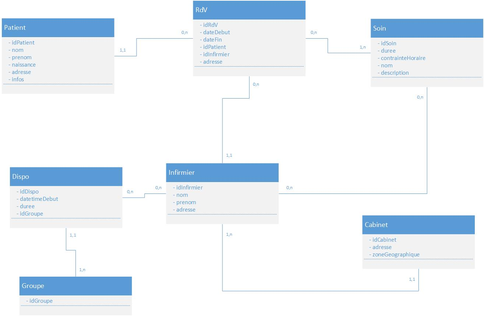

# Projet Développement Logiciel : la tournée des infirmiers

## Introduction

This repository hosts a student project which aims to help nurses who have to visit patients at their home. It consists of a web application where a nurse can login, build the list of their patients, write down the day they have to visit them (and for what kind of care) and if need be, time constraints related to them. The program will then calculate the quickest way to visit every patient in the day and return an itinerary.

## Language and packages used

We are using Python 3.5.2 with Django 1.9.9. We are building our interface with Bootstrap 3.3.5.

## How to run the project

### Installation

To run the project as it is currently developed, you first have to install Python 3.5. The next step is to install Django 1.9.9 using pip by entering the command `pip install django==1.9.9`
The optimization algorithm requires the Python Numpy library, which you will also have to install : `pip install numpy`.
You might just want to try the application without having to enter manually all your data. If it is the case we have prepared a couple data fixtures you can load, by entering the command
```bash
python3 manage.py loaddata initial_data
```

### Running the program

Go the the directory `P2016_tournee_infirmiers/tournee_infirmiers` .

```bash
cd tournee_infirmiers
```

Run the command `runserver` from the file `manage.py` using Python 3 (if you have Python 3 as default Python in your machine, python3 may be replaced by python).

```bash
python3 manage.py runserver
```

You may now access the web application in your browser at [http://localhost:8000/](http://localhost:8000/)
If you prefer to access it on another port or another ip address, you can specify these as arguments to the `runserver` command, like this :
`runserver 7000` if you want to access it at [http://localhost:7000/](http://localhost:7000/) or `runserver 1.2.3.4:7000` if you want to access it at [http://1.2.3.4:7000/](http://1.2.3.4:7000/)

### User login

You will need to log in to be able to use our app. You can manually register via our forms, which allow you to register as an office or as a nurse.
If you prefer to use the data fixtures we prepared, you can use the following credentials:
To log in as an office :
Username: Cabinet
Password: cab1net

To log in as a nurse:
Username : Infirmier
Password : Inf1rmier
Yes I know, not very safe. But you are testing on pre-generated data so that's not so big an issue. And it's still not "username/passw0rd".  

## Project structure

We chose to use Python as a programming language since most of us knew it (at least a bit) at the beginning of the project.
Also a couple libraries such as Numpy are useful for the optimization algorithm.

The framework Django was also chosen because some of us already worked on it in a precedent project. Also building a web app instead of a desktop app
makes the graphical user interface easier to program with the use of HTML/CSS/JS and various libraries such as Bootstrap.

For this first version of the application we suppose the nurse or the office using our app has its own server.
It allowed more simplicity in the coding process since we have less relationships to handle in the database.
From this assumption we can also deduce that the amount of data will not be too big and the pre-build SQLite database from Django can be efficient.
It also provides great speed in read and write operations which is important for our optimization algorithm (which can already take a long time to run).

###### Limits

This approach has its limits and not all nurses or offices can be willing to install their own web server.
Hence further development steps would probably include adding relationships to the database,
 move to a more scalable database system, and make this an online web-app usable by all offices from their browsers.

### Django Structure
Since we are using Django, our project is built on various applications which have each a specific role. They are the following :

#### User app

This app manages the creation, login, logout and every method/class related to the patients/nurses/nurse offices.
Other than the classes that are linked to database tables, this app also hosts an abstract class "Person" which is used as a superclass for both "Nurse" and "Patient",
to avoid replicating the same fields first_name/last_name/gender/address/post_code/city/phone/birth_date.

#### Event app

This app manages patient needs and appointment bookings.

#### Treatment app

This app manages the different kinds of care. Since all cares are classified by an authority, we will be using this information to build our care database.

#### Availability app

This app manages the availability of nurses (checking time constraints, etc).

#### Optimizer app

This app hosts the algorithm part of our program to build the most efficient itinerary between appointments.

#### Home app

This app manages the home page and the dashboard page (home when logged in) which gathers information from many different apps.

### Data structure

The data structure can be found in `assets/diagramme_bdd.jpg`



### Browsing structure and principles

The first page will be the home page (currently at localhost:8000). From there, you may go the login page and login. If you log in as an office you will also access an interface to manage your nurses.

*Important: we consider that the nurse office will be the "superuser" and will sign up their nurses (who won't have to register by themselves). That means there are two different kinds of user that may log in*

Once logged in, you access a dashboard with synthetic elements such as the list of your next appointments and the itinerary on Google Maps. Besides, different links allow users to go the different parts of the web application.

You may access the page to add a need to a patient (meaning, the patient needs a treatment on a certain day) so it can be taken into account by the algorithm.

You may access the page to manage your work hours and availability.

You may access the page related to your personal account and information. If you are logged in as an office, you can manage your nurses from here.

You may access the page related to your patients, view the list of them and if need be, add a new one.

### Algorithm part

Based on data such as the heals that have to be performed and their duration, the availability times of every nurse and the distance matrix between each patient location, we use a genetic algorithm to generate a schedule that is:

* realistic (for instance, no nurse can be in two locations at the same time)
* compatible with both the schedules of the nurses and the patients
* minimizes the distance between each task, so as to use the car as rarely as possible

Finding the optimal solution is a very complex problem and requires unreasonable amounts of time and computing resources. Our algorithm allows us to find a "good enough" solution by iterating a genetic process. What we mean by "schedule" is a list of tasks for each nurse, to be completed in that order.

In order to compare schedules, we define a *fitness function* that takes into account the fact that some tasks do or do not overlap, that schedules are respected, that every nurse has or does not have heals to complete and the total covered distance, and returns a positive number. The lower that number, the better the schedule.

The algorithm can then be applied:

* First, we generate a random population of schedules, based on the number of nurses and the heals to perform.
* We then make that population evolve, using a process based on several ways of modifying it: mutation, crossing-over and selection (see below)
* The evolution process is iterated several times; after each iteration, the schedules in the current population are expected to perform better (with regards to the fitness function) than the previous ones
* Once a good enough schedule is found, or the number of iterations exceeds a predetermined number, we can choose the final schedule.

The actions that can be performed on a population include:

* Mutation: given one schedule, a new one is generated by the following process: two nurses are chosen at random, and a random task is swapped between the two. This gives us a new schedule that can be added to the population.
* Crossing-over: given two schedules, for every nurse, we generate a new schedule by mixing the two parent schedules. This gives us a new schedule that is added to the population.
* Selection: the schedules are compared by pairs, and the one that performs better (with regards to the fitness function) is deleted --- most of the time. Some schedules that are worse than their opponent can still randomly win with some probability; this allows the population to not converge too fast towards a mediocre solution.

## Timeline

The project will be carried out in Agile methodology. Here is a summary of the progress so far.

Sprint | Ending date | Progress
--- | --- | ---
Sprint 1 | 12th December | First elements of interface are present, first models are implemented
Sprint 2 | 9th January | Main components of the web application are there to allow a smooth browsing experience, models are easily used
Sprint 3 | 30th January | Algorithm is chosen and implemented ; main front components and connexion to database are properly working.
Sprint 4 | 10th February | The application is working : a user can trigger the optimization of nurses paths for the chosen day.

## Contact information

Renaud Dahl : renaud.dahl@student.ecp.fr
Paul de Nonancourt : paul.de-nonancourt@student.ecp.fr
Amaury Duval : amaury.duval@student.ecp.fr
Guillaume Guerdoux : guillaume.guerdoux@student.ecp.fr
Alice Lasseigne : alice.lasseigne@student.ecp.fr
Grégoire Locqueville : gregoire.locqueville@student.ecp.fr
