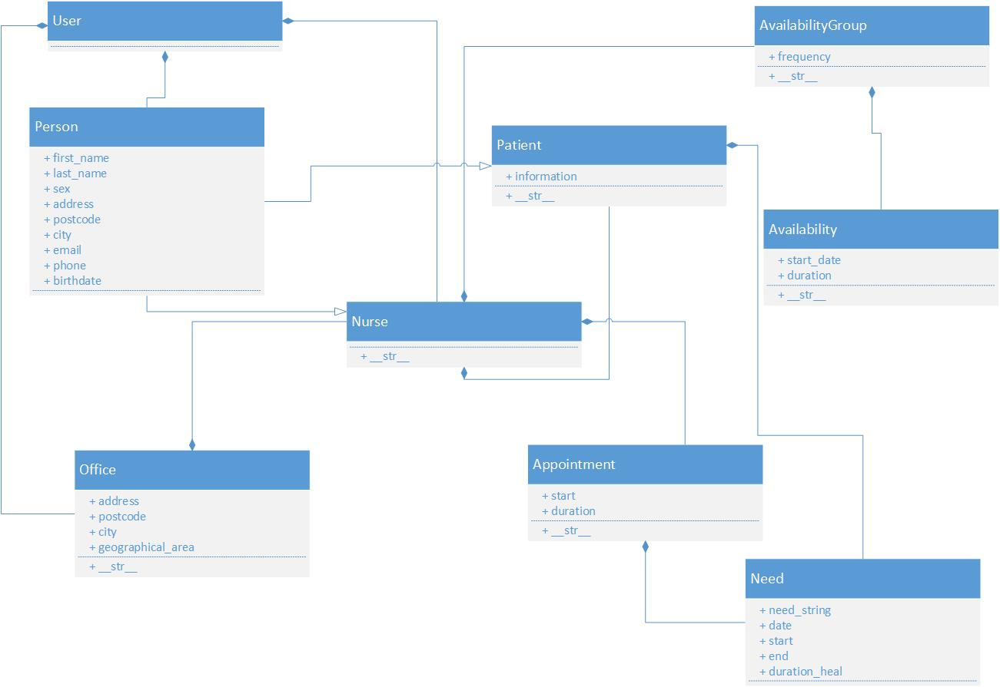

# Projet Développement Logiciel : la tournée des infirmiers

## Introduction

This repository hosts a student project which aims to help nurses who have to visit patients at their home. It consists of a web application where a nurse can login, build the list of their patients, write down the day they have to visit them (and for what kind of care) and if need be, time constraints related to them. The program will then calculate the quickest way to visit every patient in the day and return an itinerary.

## Language and packages used

We are using Python 3.5.2 with Django 1.9.9. We are building our interface with Bootstrap 3.3.5.

## How to run the project

### Installation 

To run the project as it is currently developed, you first have to install Python 3.5. The next step is to install Django 1.9.9 using pip by entering the command `pip install django==1.9.9` 

### Running the program

Go the the directory `P2016_tournee_infirmiers/tournee_infirmiers` .

```bash
cd tournee_infirmiers
```

Run the command `runserver` from the file `manage.py` using Python 3 (if you have Python 3 as default Python in your machine, python3 may be replaced by python).

```bash
python3 manage.py runserver
```

You may now access the web application in your browser at [http://localhost:8000/]{http://localhost:8000/}

### Admin user

If you need to login as admin user, use the following credentials:
Username: admin
Password: infirmier

## Project structure

### Django Structure 
Since we are using Django, our project is built on various applications which have each a specific role. They are the following

#### App User

This app manages the creation, login, logout and every method/class related to the patients/nurses/nurse offices

#### App Event

This app manages requests and appointment bookings

#### App Treatment

This app manages the different kinds of care. Since all cares are classified by an authority, we will be using this information to build our care database.

#### App Availability

This app manages the availability of nurses (checking time constraints, etc.)

#### App Optimizer

This app will host the algorithm part of our program to build the most efficient itinerary

#### App Home

This app manages the home page and all static pages related to the interface

### Data structure

The data structure can be found in `assets/diagramme_bdd.jpg`



### Browsing structure and principles

The first page will be the home page (currently at localhost:8000). From there, you may go the login page and login as a nurse. If you are the nurse office, you may login as so, accessing an interface to manage your nurses

*Important: we consider that the nurse office will be the "superuser" and will sign up their nurses (who won't have to register by themselves). That means there are two different kinds of user that may log in*

Once logged in, you access a dashboard with synthetic elements such as the list of your next appointments and the itinerary on Google Maps. Besides, different links allow users to go the different parts of the web application.

You may access the page to add a treatment to a patient so it can be taken into acount by the algorithm

You may access the page to manage your work hours and availability

You may access the page related to your personnal account and information

You may access the page related to your patients, view the list of them and if need be, add a new one.

### Algorithm part

The optimization problem will be tackled later on (cf Timeline) and is not addressed yet.

## Timeline

The project will be carried out in Agile methodology. Here is a summary of the progress so far.

Sprint | Ending date | Progress
--- | --- | ---
Sprint 1 | 12th December | First elements of interface are present, first models are implemented
Sprint 2 | 9th January | Main components of the web application are there to allow a smooth browsing experience, models are easily used
Sprint 3 | TBD | TBD

## Contact information

Renaud Dahl : renaud.dahl@student.ecp.fr
Paul de Nonancourt : paul.de-nonancourt@student.ecp.fr
Amaury Duval : amaury.duval@student.ecp.fr
Guillaume Guerdoux : guillaume.guerdoux@student.ecp.fr
Alice Lasseigne : alice.lasseigne@student.ecp.fr
Grégoire Locqueville : gregoire.locqueville@student.ecp.fr
